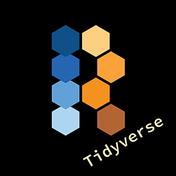

# Introduction {#intro}

## Everything you need for EDAV

This resource has everything you need and more to be successful with R, this EDAV course, and beyond. Let's get started!

With this resource, we try to give you a **curated collection of tools and references** that will make it easier to learn how to work with data in R. 

In addition, we include sections on **basic chart types/tools** so you can learn by doing.

There are also **several walkthroughs** where we work with data and discuss problems as well as some tips/tricks that will help you.

We hope this resource serves you well.

## What the Banners Mean

The banners at the top of each page are an effort to improve your ability to navigate this resource. Each one is color-coded based on its content and has a unique icon to improve recall. There are four types:

### Blue Pages

**Blue == INFO**: The blue banners signal pages that contain basic **information**. Examples of blue pages include this introduction page and the [basics page](basics.html), which explains how to setup R/RStudio as well as ways to get help if you need it. Blue pages are the help desk of this resource: look to them if you are lost and need to find your way.

### Red Pages

**Red == WALK**: The red banners signal pages that contain more extensive **walkthroughs**. An example of a red page is the [iris walkthrough](iris.html), where a well-known dataset is presented as a pretty scatterplot and steps are shown from start to finish. This page type is the most thorough: it trys to provide full documentation, explanations of design choices, and advice on best practices. It's like going to office hours and having a great clarifying chat with a course assistant...in article form. If you would like to see a fully-worked-through example of something with a lot of guidance along the way, check out the red pages.

### Green Pages

**Green == DOC**: The green banners signal pages that contain more compact **documentation**. An example of a green page is the [histogram page](histo.html), which includes simple examples of how to create histograms, when to use them, and things to be aware of/watch out for. The green pages hold your hand much less than the red pages: they explain how to use a chart/tool using examples and simple terms. If you have an idea in mind and are just wondering how to execute it, the green pages will help fill in those gaps.

### Yellow Pages

**Yellow == REF**: The yellow banners signal pages that contain simple collections of  **references**. An example of a yellow page is the [external resources page](general.html), which is a list of materials that you can look through and learn from. Yellow pages have the least amount of hand-holding: they are collections of resources and references that will help you learn about new things. 

## Help Improve *edav.info/*

Not finding what you are looking for? Think a section could be made clearer? Consider helping improve *edav.info/* by submitting a pull request to the [github page](https://github.com/jtr13/EDAV){target="_blank"}. Don't understand that last sentence? We have a [page on how you can contribute to *edav.info/*](contribute.html).

## Fun Stuff: T-Shirts

Zach Bogart has made a few t-shirts available on [Teespring](https://teespring.com/stores/edav){target="_blank"} so you can show your love for EDAV and R. Hope you enjoy. 

*P.S. Designing a cool shirt or sticker is a great addition to your community contribution. It has to be cool, though :)*

{target="_blank" class="active-banner"}
 
{target="_blank" class="active-banner"}
{target="_blank" class="active-banner"}

<!-- [EDAV Logo Shirt](https://teespring.com/edav-single){target="_blank"}  -->
<!-- [R Shirt](https://teespring.com/r-hex-edav){target="_blank"}  -->
<!-- [Tidyverse R Shirt](https://teespring.com/edav-tidyverse){target="_blank"}  -->

